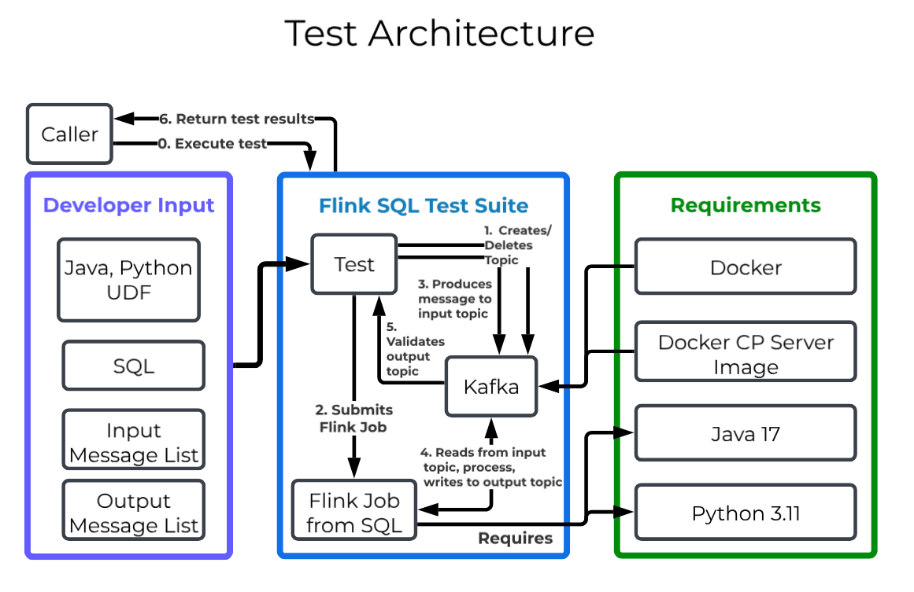

# Flink SQL Test Suite

Flink SQL integration suite that ensures the input and output topic messages are tested when using with Kafka. 



##  Use Cases

1. Add business logic tests for stability
1. Re-use production-ready SQL file for test environment
1. Quickly integrate into CI/CD via test parameters

##  Dependencies

- Docker
- Java 17
- Python (if Python UDF is used)

## Supported Versions

- Flink=2.1.1
- Kafka=4.1.1
- Python=3.11
- Java >= 17

## Supported Features

- SQL statements
- Specify input and output topic and send messages
- Java UDF
- Python UDF
- Production SQLs can be re-used without modification (for example, ssl.truststore parameters are automatically removed so it can connect to kafka in a container)

# Test Examples

## Simple test

**Test Command**

```sh
mvn test -Dtest=FlinkKafkaFileBasedTest \
  -DsqlFile=src/test/resources/test-cases/my-test/query.sql \
  -DinputFile=src/test/resources/test-cases/my-test/input.txt \
  -DoutputFile=src/test/resources/test-cases/my-test/output.txt
```

**query.sql**

```sql
CREATE TABLE person_input (
  name STRING,
  age INT
) WITH (
  'connector' = 'kafka',
  'topic' = 'person-input-file2',
  'properties.bootstrap.servers' = 'kafka:9092',
  'properties.group.id' = 'flink-test-group-file',
  'scan.startup.mode' = 'earliest-offset',
  'format' = 'json'
)
-----
CREATE TABLE person_output (
  name STRING,
  age INT
) WITH (
  'connector' = 'kafka',
  'topic' = 'person-output-file2',
  'properties.bootstrap.servers' = 'kafka:9092',
  'format' = 'json'
)
-----
INSERT INTO person_output
SELECT name, age
FROM person_input
WHERE age >= 18
```


**input.txt**

The format must be `<topic>:<message>`

```
person-input-file2:{"name":"Alice","age":25}
person-input-file2:{"name":"Bob","age":17}
person-input-file2:{"name":"Charlie","age":30}
```


**output.txt**

The format must be `<topic>:<message>`

```
person-output-file2:{"name":"alice","age":25}
person-output-file2:{"name":"charlie","age":30}
```

**Success Case**

```
✓ Test passed! Output matches expected results.
✓ Job cancelled successfully
[INFO] Tests run: 1, Failures: 0, Errors: 0, Skipped: 0, Time elapsed: 22.788 s - in com.example.flink.FlinkKafkaFileBasedTest
[INFO] 
[INFO] Results:
[INFO] 
[INFO] Tests run: 1, Failures: 0, Errors: 0, Skipped: 0
```


**Fail Case**

```
[ERROR] Failures: 
[ERROR]   FlinkKafkaFileBasedTest.testFlinkSQLFromFile:205->verifyOutput:678 Expected message not found in topic person-output-file2: {"name":"alice","age":25}
Actual messages: [{"name":"Alice","age":25}, {"name":"Charlie","age":30}] ==> expected: <true> but was: <false>
[INFO] 
[ERROR] Tests run: 1, Failures: 1, Errors: 0, Skipped: 0
```


## With Java UDFs

```sh
mvn test -Dtest=FlinkKafkaFileBasedTest \
  -DsqlFile=query.sql \
  -DinputFile=input.txt \
  -DoutputFile=output.txt \
  -DjavaJars=./my-jar-folder/udf.jar
```

**query.sql**

Note: `ADD JAR` is used for staging/production but not locally. `-DjavaJars` overwrites `ADD JAR` declaration. For example `-DjavaJars=./my-jar-folder/udf.jar,./my-another-jar-folder/udf2.jar` , then it executes

-  `ADD JAR ./my-jar-folder/udf.jar` and
-  `ADD JAR ./my-another-jar-folder/udf2.jar`.


```sql
ADD JAR '/opt/flink/jars/udf-example-2.1.0-1.0.jar'
-----
CREATE FUNCTION AddTwo AS 'com.example.my.AddTwo'
-----
CREATE TABLE person_input (
  name STRING,
  age INT
) WITH (
  'connector' = 'kafka',
  'topic' = 'person-input-file2',
  'properties.bootstrap.servers' = 'kafka:9092',
  'properties.group.id' = 'flink-test-group-file',
  'scan.startup.mode' = 'earliest-offset',
  'format' = 'json'
)
-----
CREATE TABLE person_output (
  name STRING,
  age INT
) WITH (
  'connector' = 'kafka',
  'topic' = 'person-output-file2',
  'properties.bootstrap.servers' = 'kafka:9092',
  'format' = 'json'
)
-----
INSERT INTO person_output
SELECT name, AddTwo(age)
FROM person_input
WHERE age >= 18
```


## With Python UDFs

`-DpythonPath` sets the `python.files` in Flink configuration.


```sh
mvn test -Dtest=FlinkKafkaFileBasedTest \
  -DsqlFile=query.sql \
  -DinputFile=input.txt \
  -DoutputFile=output.txt \
  -DpythonPath=./my-python-udfs
```

**Python UDF Folder structure**

```
my-python-udfs/
├── my_udfs.py
```

**query.sql**

```sql
CREATE TEMPORARY FUNCTION py_upper AS 'my_udfs.my_python_udf' LANGUAGE PYTHON;
-----
CREATE TABLE person_input (
  name STRING,
  age INT
) WITH (
  'connector' = 'kafka',
  'topic' = 'person-input-file2',
  'properties.bootstrap.servers' = 'kafka.svc.cluster.local:9092',
  'properties.security.protocol' = 'SSL',
  'properties.group.id' = 'flink-test-group-file',
  'scan.startup.mode' = 'earliest-offset',
  'format' = 'json'
)
-----
CREATE TABLE person_output (
  name STRING,
  age INT
) WITH (
  'connector' = 'kafka',
  'topic' = 'person-output-file2',
  'properties.bootstrap.servers' = 'kafka.svc.cluster.local:9092',
  'properties.security.protocol' = 'SSL',
  'format' = 'json'
)
-----
INSERT INTO person_output
SELECT py_upper(name), age
FROM person_input
WHERE age >= 18
```

**my_udfs.py**

```python
from pyflink.table.udf import udf
from pyflink.table import DataTypes

@udf(result_type=DataTypes.STRING())
def my_python_udf(input_str):
    # Your UDF logic here
    return input_str.upper() + "_processed"

@udf(result_type=DataTypes.INT())
def calculate_length(input_str):
    return len(input_str) if input_str else 0
```

### With both Java and Python UDFs

```
mvn test -Dtest=FlinkKafkaFileBasedTest \
  -DsqlFile=query.sql \
  -DinputFile=input.txt \
  -DoutputFile=output.txt \
  -DjavaJars=udf.jar \
  -DpythonPath=python-udf
```


# Setup

## Python Env

Python 3.11 is required.

To achieve this, setup virtual env 

```sh
python3.11 -m venv .venv
source .venv/bin/activate
pip install apache-flink==2.1.1
```


# Parameters

## Required (no defaults)

The test parameters can be used so that `sqlFile`  becomes `-DsqlFile=my-file.sql`

### sqlFile

(**Required**) SQL statements file where 

- each statement must be delimited by five hyphens (i.e. `-----`)
- it must contain an INSERT command to submit a job

```
CREATE TABLE person_input (
  name STRING,
  age INT
) WITH (
  'connector' = 'kafka',
  'topic' = 'person-input-file2',
  'properties.bootstrap.servers' = 'kafka.svc.cluster.local:9092',
  'properties.security.protocol' = 'SSL',
  'properties.group.id' = 'flink-test-group-file',
  'scan.startup.mode' = 'earliest-offset',
  'format' = 'json'
)
-----
CREATE TABLE person_output (
  name STRING,
  age INT
) WITH (
  'connector' = 'kafka',
  'topic' = 'person-output-file2',
  'properties.bootstrap.servers' = 'kafka.svc.cluster.local:9092',
  'properties.security.protocol' = 'SSL',
  'format' = 'json'
)
-----
INSERT INTO person_output
SELECT name, age
FROM person_input
WHERE age >= 18
```

### inputFile

(**Required**) Input test messages written into Kafka. The format must be `<topic>:<message>`. The test runner will write to `<topic>` for each `<message>` sequentially.

```
person-input-file2:{"name":"Alice","age":25}
person-input-file2:{"name":"Bob","age":17}
person-input-file2:{"name":"Charlie","age":30}
```

### outputFile

(**Required**) Output test messages read from Kafka. The format must be `<topic>:<message>`. The test runner will read from `<topic>` to look for `<message>`.

```
person-output-file2:{"name":"Alice","age":25}
person-output-file2:{"name":"Charlie","age":30}
```

### javaJars

(**Optional**) A comma-separated Java UDF JAR paths. Any `ADD JAR` statement in SQL will be ignored and instead, it will execute the JARs specified by this parameter. 


Example: 

`-DjavaJars=./my-java-jars/udf-samples.jar,./my-java-jars/udf-samples2.jar`


### pythonPath

(**Optional**) Python UDF folder or file where the python UDF refers to.


For Example, in this structure `-DpythonPath=./my-python-udfs` should be specified:

```
my-python-udfs/
├── my_udfs.py
```


# TODOs

- Avro integration with Schema Registry TestContainer
- Performance testing
- Support datagen connector for heartbeat pattern
- Full docker integration


# FAQ

### How does the test work internally?

This test will:

1. Use Testcontainers to start Kafka
2. Wait for Kafka to be healthy
3. Create tables, Run the Flink Insert SQL
4. Produces to Kafka's input topic
5. Consumes from output topic
6. Validates the output messages against expected
7. Removes the Flink job created by Insert SQL
8. Tear down Testcontainers
